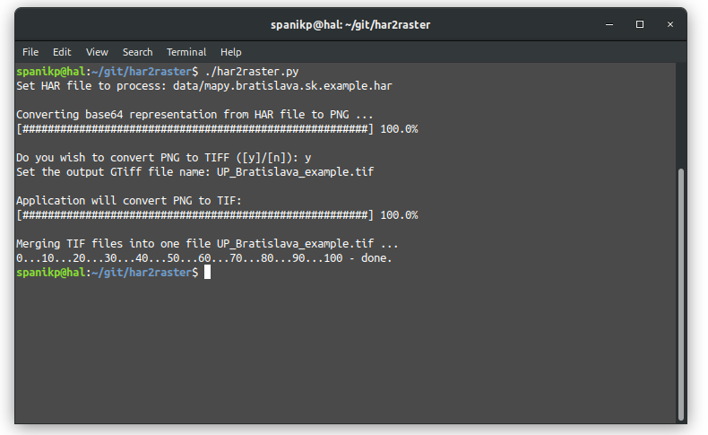

### har2raster.py

Funkcia na konverziu HAR súborov (v podstate JSON súbor ktorý vznikne pri tvorbe cache z dopytov na mapové dlaždice, resp. aj pri akomkoľvek dopytovaní na server). V HAR súbore sú uložené dlaždice vo forme base64 reťazca, ktorý sa dá dekódovať na PNG obrázok (online nástroj na ukážku [tu](https://codebeautify.org/base64-to-image-converter)). Funkcia bola navrhnutá primárne na konverziu územneho plánu Bratislavy zo servera [https://mapy.bratislava.sk](https://mapy.bratislava.sk) do PNG/TIFF súborov.

Na dosiahnutie dobrého výsledku konverzie, tak aby nedochádzalo k prekrytu dlaždíc, odporúčam pouziť pri vytváraní HAR súboru nasledovný postup:

1. Otvorenie stránky [https://mapy.bratislava.sk](https://mapy.bratislava.sk) v Google Chrome
2. Zoom na požadované miesto na mape (v tomto kroku sa treba rozhodnúť aký zoom bude mať výstup, pri ďalšom postupe ho už nemeniť!)
3. Vypnutie všetkých vrstiev (aj podkladovej mapy)
4. Zapnutie developer modu (Ctrl + Shift + I)
5. Zapnutie vrstvy mapy, ktorú chcem stiahnuť (odporúčam zapnúť len jednu vrstvu, pri potrebe viacerých vrstiev opakovať postup)
6. Cacheovanie mapy postupným posunom na mape v záujmovej oblasti
7. Po ukončení cache stiahnuť HAR súbor z Developer rozhrania: Záložka ```Network > Img > Headers```, kde je zoznam requestov > pravý klik > ```Save as HAR with content```

Na správne fungovanie funkcie je potrebné mať nainštalovanú a v premennej ```PATH```  pridanú knižnicu [GDAL](https://www.gdal.org/). Na otestovanie funkcionality použite súbor ```data/mapy.bratislava.sk.example.har``` .

Ukážka terminálu pri spustení funckie na ukážkových dátach:
<p align="center">
  
</p>

Územný plán Bratislavy po stiahnutí pomocou ```har2raster.py```.
<p align="center">
  
</p>
